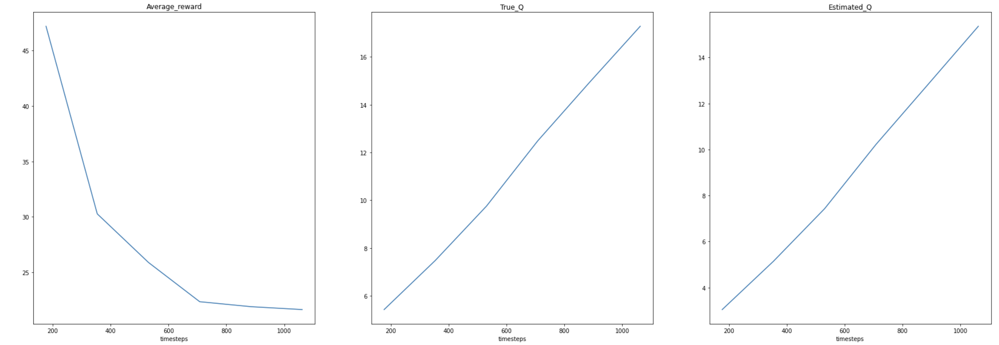
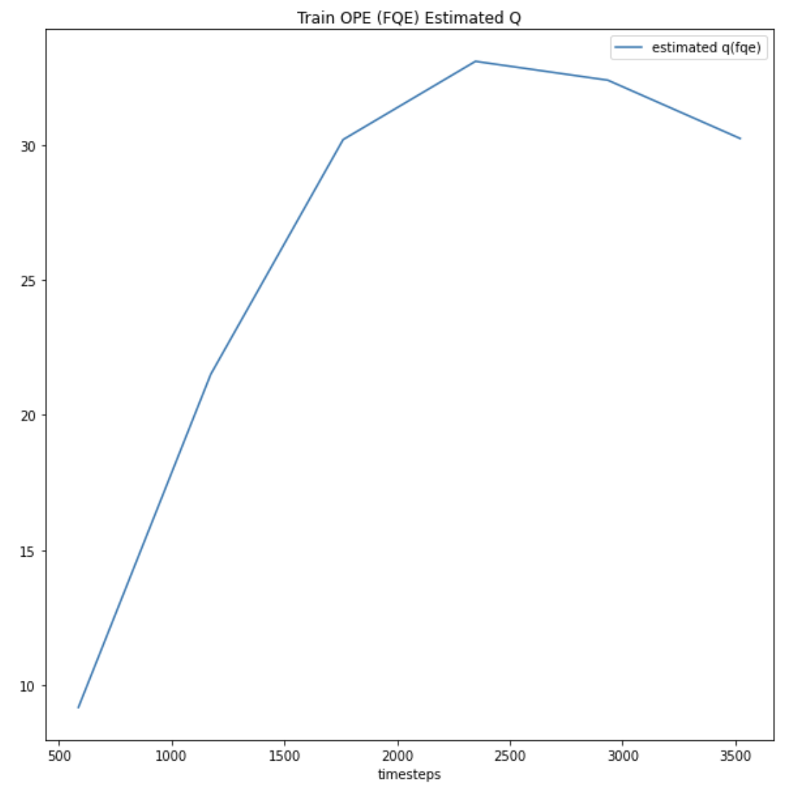

# Offline Reinforcement Learning Pipeline

***AIPI 530 Take Home Challenge - Bodong Xu***


# Introduction
The repository is created for AIPI 530 Take Home Project.

The objectives of this project is 
* Train CQL 
   * Pick [PyBullet](https://pybullet.org/wordpress/) environment/dataset in [d3rlpy](https://github.com/takuseno/d3rlpy) and assess the following results
   * Average reward vs training steps 
   * True Q vs training steps
   * Estimated Q vs training steps 
* Train OPE (FQE) to evaluate the Estimated Q

# Installation
**1. Git clone the repository.**
```
!git clone https://github.com/BD-X/Offline-RL
```
**2. Install the related packages.** Including the pybullet dataset and other requirements.
```
!pip install git+https://github.com/takuseno/d4rl-pybullet
!pip install Cython numpy # if not installed
!pip install -e .
```

# How to Get Start - Training & Examples

**1. Execute **`train_cql_bx.py`** file**, which can be found at the root. We can customize the epochs we want to run by setting the para `epochs_cql` and `epochs_fqe`. 
```
!python train_cql_bx.py --epochs_cql 6 --epochs_fqe 6
```

**2. How to find log results.**
* The log files paths have been set consistent, in `d3rlpy_log/CQL_results` and `d3rlpy_log/FQE_results`.
* Important log files:
   * Average reward vs training steps `./CQL_results/environment.csv`
   * True Q vs training steps `./CQL_results/true_q_value.csv`
   * Estimated Q vs training steps `./CQL_results/estimated_q.csv`
   * FQE estimated Q `./FQE_results/init_value.csv`

**3. Sample results. (6 epochs)**
* Train CQL
<p align="center"></p>

* Train FQE
<p align="center"></p>

**4. *Example Notebook***

* The sample implementation of the repository

  [](https://colab.research.google.com/drive/1LpVPkUccR3gscV_bFZTkcHkmbsz0ixCf?usp=sharing)

# More about d3rlpy


```py
import d3rlpy

dataset, env = d3rlpy.datasets.get_dataset("hopper-medium-v0")

# prepare algorithm
sac = d3rlpy.algos.SAC()

# train offline
sac.fit(dataset, n_steps=1000000)

# train online
sac.fit_online(env, n_steps=1000000)

# ready to control
actions = sac.predict(x)
```

- Documentation: https://d3rlpy.readthedocs.io
- Paper: https://arxiv.org/abs/2111.03788

## key features

### Most Practical RL Library Ever
- **offline RL**: d3rlpy supports state-of-the-art offline RL algorithms. Offline RL is extremely powerful when the online interaction is not feasible during training (e.g. robotics, medical).
- **online RL**: d3rlpy also supports conventional state-of-the-art online training algorithms without any compromising, which means that you can solve any kinds of RL problems only with `d3rlpy`.
- **advanced engineering**: d3rlpy is designed to implement the faster and efficient training algorithms. For example, you can train Atari environments with x4 less memory space and as fast as the fastest RL library.

### Easy-To-Use API
- **zero-knowledge of DL library**: d3rlpy provides many state-of-the-art algorithms through intuitive APIs. You can become a RL engineer even without knowing how to use deep learning libraries.
- **scikit-learn compatibility**: d3rlpy is not only easy, but also completely compatible with scikit-learn API, which means that you can maximize your productivity with the useful scikit-learn's utilities.

### Beyond State-Of-The-Art
- **distributional Q function**: d3rlpy is the first library that supports distributional Q functions in the all algorithms. The distributional Q function is known as the very powerful method to achieve the state-of-the-performance.
- **many tweek options**: d3rlpy is also the first to support N-step TD backup and ensemble value functions in the all algorithms, which lead you to the place no one ever reached yet.


## installation
d3rlpy supports Linux, macOS and Windows.

### PyPI (recommended)
```
$ pip install d3rlpy
```

### Docker
```
$ docker run -it --gpus all --name d3rlpy takuseno/d3rlpy:latest bash
```

## supported algorithms
| algorithm | discrete control | continuous control | offline RL? |
|:-|:-:|:-:|:-:|
| Behavior Cloning (supervised learning) | :white_check_mark: | :white_check_mark: | |
| [Deep Q-Network (DQN)](https://www.nature.com/articles/nature14236) | :white_check_mark: | :no_entry: | |
| [Double DQN](https://arxiv.org/abs/1509.06461) | :white_check_mark: | :no_entry: | |
| [Deep Deterministic Policy Gradients (DDPG)](https://arxiv.org/abs/1509.02971) | :no_entry: | :white_check_mark: | |
| [Twin Delayed Deep Deterministic Policy Gradients (TD3)](https://arxiv.org/abs/1802.09477) | :no_entry: | :white_check_mark: | |
| [Soft Actor-Critic (SAC)](https://arxiv.org/abs/1812.05905) | :white_check_mark: | :white_check_mark: | |
| [Batch Constrained Q-learning (BCQ)](https://arxiv.org/abs/1812.02900) | :white_check_mark: | :white_check_mark: | :white_check_mark: |
| [Bootstrapping Error Accumulation Reduction (BEAR)](https://arxiv.org/abs/1906.00949) | :no_entry: | :white_check_mark: | :white_check_mark: |
| [Advantage-Weighted Regression (AWR)](https://arxiv.org/abs/1910.00177) | :white_check_mark: | :white_check_mark: | :white_check_mark: |
| [Conservative Q-Learning (CQL)](https://arxiv.org/abs/2006.04779) | :white_check_mark: | :white_check_mark: | :white_check_mark: |
| [Advantage Weighted Actor-Critic (AWAC)](https://arxiv.org/abs/2006.09359) | :no_entry: | :white_check_mark: | :white_check_mark: |
| [Critic Reguralized Regression (CRR)](https://arxiv.org/abs/2006.15134) | :no_entry: | :white_check_mark: | :white_check_mark: |
| [Policy in Latent Action Space (PLAS)](https://arxiv.org/abs/2011.07213) | :no_entry: | :white_check_mark: | :white_check_mark: |
| [TD3+BC](https://arxiv.org/abs/2106.06860) | :no_entry: | :white_check_mark: | :white_check_mark: |
| [Implicit Q-Learning (IQL)](https://arxiv.org/abs/2110.06169) | :no_entry: | :white_check_mark: | :white_check_mark: |

## supported Q functions
- [x] standard Q function
- [x] [Quantile Regression](https://arxiv.org/abs/1710.10044)
- [x] [Implicit Quantile Network](https://arxiv.org/abs/1806.06923)

## experimental features
- Model-based Algorithms
  - [Model-based Offline Policy Optimization (MOPO)](https://arxiv.org/abs/2005.13239)
  - [Conservative Offline Model-Based Policy Optimization (COMBO)](https://arxiv.org/abs/2102.08363)
- Q-functions
  - [Fully parametrized Quantile Function](https://arxiv.org/abs/1911.02140) (experimental)

## examples

### PyBullet
<p align="center"></p>

```py
import d3rlpy

# prepare dataset
dataset, env = d3rlpy.datasets.get_pybullet('hopper-bullet-mixed-v0')

# prepare algorithm
cql = d3rlpy.algos.CQL(use_gpu=True)

# start training
cql.fit(dataset,
        eval_episodes=dataset,
        n_epochs=100,
        scorers={
            'environment': d3rlpy.metrics.evaluate_on_environment(env),
            'td_error': d3rlpy.metrics.td_error_scorer
        })
```

See more PyBullet datasets at [d4rl-pybullet](https://github.com/takuseno/d4rl-pybullet).

### Online Training
```py
import d3rlpy
import gym

# prepare environment
env = gym.make('HopperBulletEnv-v0')
eval_env = gym.make('HopperBulletEnv-v0')

# prepare algorithm
sac = d3rlpy.algos.SAC(use_gpu=True)

# prepare replay buffer
buffer = d3rlpy.online.buffers.ReplayBuffer(maxlen=1000000, env=env)

# start training
sac.fit_online(env, buffer, n_steps=1000000, eval_env=eval_env)
```

## tutorials
Try a cartpole example on Google Colaboratory!

- offline RL tutorial: [](https://colab.research.google.com/github/takuseno/d3rlpy/blob/master/tutorials/cartpole.ipynb)
- online RL tutorial: [](https://colab.research.google.com/github/takuseno/d3rlpy/blob/master/tutorials/online.ipynb)


# Citation
The paper is available [here](https://arxiv.org/abs/2111.03788).
```
@InProceedings{seno2021d3rlpy,
  author = {Takuma Seno, Michita Imai},
  title = {d3rlpy: An Offline Deep Reinforcement Library},
  booktitle = {NeurIPS 2021 Offline Reinforcement Learning Workshop},
  month = {December},
  year = {2021}
}
```

